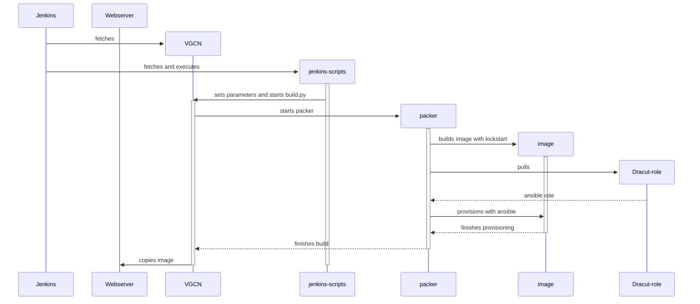

# Bare Metal VGCN with Network Boot

In contrast to the industry trend, using compute nodes without virtualization can have several benefits, such as:
- less overhead for hypervisors
- reduced system complexity
- more direct control
- almost no overhead for adding or removing servers

While installing and maintaining tens to hundreds of disk installations on these servers is a tedious task and economically unviable, running the servers in a network boot setup keeps a whole cluster maintainable with relatively few resources.

## Basic concepts – From Power to SSH

Pre-boot execution environment (PXE Boot) is software that runs directly on the network interface card (NIC). Configuration is done in multiple steps, called stages.

### Stage 1: DHCP and TFTP

If configured in BIOS/EFI, after obtaining an IP address from the DHCP server, the NIC requests a `file` and an IP address for a so-called `NextServer`. It will then contact this server using the `trivial file transfer protocol` (TFTP) and try to fetch a bootfile using the `file` from the DHCP server.

This file is called [ipxe.efi](https://github.com/usegalaxy-eu/infrastructure-playbook/blob/master/files/dnbd3/ipxe.efi) in our case and is a binary that was compiled from the official [iPXE Repository](https://github.com/ipxe/ipxe) by embedding our [ipxe script](https://gist.github.com/mira-miracoli/c7463fad492fcd6671561dc8df2547c0).

### Stage 2: Kernel and InitramFS

This iPXE extends the NIC's firmware-included PXE and allows the NIC to use HTTP instead of TFTP. The embedded script contains the link to a `boot.menu` file which is fetched from dnbd3-primary.galaxyproject.eu. When executing this [boot.menu][boot_menu] file, it fetches a `kernel` and `initramFS` using HTTP and executes a boot command in which some `SLX` variables are set and which could be extended in order to set a [root-password](#set-a-root-password). Please keep in mind that the HTTP server is protected by network restriction only.

### Stage 3: SLX and DNBD3

SLX (StateLess eXtensions) is the company which initially developed the DNBD3 protocol, but the [repository](https://git.openslx.org/) is now maintained by the University of Freiburg.

In the so-called 'Stage 3', the client boots the initramFS and kernel using the provided kernel command line, fetches SLX configurations, and sets up the DNBD3 device:

- Detects hardware
- Sets up network
- Downloads the [SLX config][slx_config] from HTTP server
- Sets up [RW space](#disk-setup) using a disk if it contains `PARTLABEL="OPENSLX_SYS"` and using RAMdisk as fallback otherwise
- Combines the RW space with the RO DNBD3 image as `xloop` device called as set in `SLX_SYSTEM_PARTITION_IDENTIFIER` (usually 'system')
- Mounts `/dev/mapper/root` to `/sysroot`
- Downloads the 'pxe-config-tarball' from the HTTP server which is built from [pxe-config-tarball][pxe-config-tarball] repository using Jenkins. Unpacks it to `/`
- `switch_root /sysroot`

### Stage 4: DNBD3

Now the actual VGCN image boots and you should see a login screen in IPMI and be able to SSH.

## How To (A-Z)

### Add Nodes to the Bare Metal Compute Cluster

(from issue [#756](https://github.com/usegalaxy-eu/issues/issues/756))

#### Check for each node

1. Is the DHCP `next server` set accordingly, or is it set globally?
2. Set the hostname, following the scheme: `cxxxmxxxgx-nxxxx.bi.privat`
3. Set the IPMI credentials as set in the ansible-vault

#### Add the nodes to the new [vgcn-infrastructure-playbook](https://github.com/usegalaxy-eu/vgcn-infrastructure-playbook)

1. Select a host-group (use `[test]` first)
2. Wait for the deployment to finish and check [Telegraf Script was added to VGCN-Infrastructure-Playbook](https://github.com/usegalaxy-eu/vgcn-infrastructure-playbook/pull/13) and using this [dashboard](https://stats.galaxyproject.eu/goto/ngJ_Mg_Ng?orgId=1) we can monitor if the storage config is correct for each PXE node

**GPU-Compute mixed nodes**

If we migrate large GPU nodes that contain only one GPU but have large compute resources (>100 cores and >100GB RAM), we should use HTCondor's [partitionable slot feature](https://htcondor.readthedocs.io/en/latest/admin-manual/ep-policy-configuration.html#partitionable-slots); see also [issue #800](https://github.com/usegalaxy-eu/issues/issues/800).

#### Move to production

Once the disk setup is correct (everything green in the dashboard), we can move the nodes from `[test]` group to their production group (e.g. `compute`).

### Build and Deploy Images

[VGCN-Image-Build](https://build.galaxyproject.eu/job/usegalaxy-eu/job/VGCN-Image-Build) Jenkins project builds the actual `VGCN image` using Packer and Ansible, as well as a kernel and an initramFS. All three artifacts are then copied to the [dnbd3-primary](#dnbd3-primarygalaxyprojecteu).

The pipeline is defined in Groovy in the [jenkins-scripts repository](https://github.com/usegalaxy-eu/jenkins-scripts/blob/vgcn-pipeline-pxe/Jenkinsfile).

#### Build

If you want to trigger a new image build, click on `Build with Parameters` and select the following for a 'normal' PXE image (yes, **always** with GPU):

1. **GENERIC**: generic
2. **TEMPLATE**: rockylinux-9-latest-x86_64
3. **FLAVOR**: workers-gpu
4. **SCOPE**: internal
5. **PXE**: pxe
6. **DELIVER_KVM**: no
7. **FORMAT**: qcow2

The last one is especially important because the [SLX config][slx_config] is configured to use qcow2 and not raw; otherwise the image is not compressed which can lead to creepy disk errors after several days.

#### Rollout

In order to bring this new image to production, do the following:

1. Change the revision ID in the [SLX config][slx_config]
2. [Reboot](#reboot--power-cycle) a worker node that is currently idle or, if you want to be on the safe side, move that worker to the [test host group](#add-nodes-to-the-bare-metal-compute-cluster) before rebooting it, so it does not get integrated into production after reboot and CI run.
3. SSH to the node and check that the new image was picked (you should see it in the MOTD) and make sure everything looks good. Maybe run a test job from the training-pxe-test. If you added the node to the test host group and everything is good, just reboot other servers (if immediate rollout is required). Otherwise, change the revision ID back to the previous value on the dnbd3-primary.galaxyproject.eu and in the Ansible variable.

### Mount a new NFS share

Make sure the shares are accessible on the subnet used by our bare metal cluster. Add it to the [mounts repo](https://github.com/usegalaxy-eu/mounts/blob/main/mountpoints.yml) as usual. Run [VGCN-Infrastructure-Playbook on Jenkins](https://build.galaxyproject.eu/job/usegalaxy-eu/job/VGCN-Infrastructure-Playbook). The new shares should now be available. In case you want to manually debug/check, you can use `pssh` as usual. For a hosts file, run:

```bash
wget https://raw.githubusercontent.com/usegalaxy-eu/vgcn-infrastructure-playbook/refs/heads/main/hosts && sed -i '/^\[.*\]$/{ :a; n; /^\[/!ba; x; d; }' hosts
```

### Reboot / Power cycle

**SSH**

:smile:

**non-SSH**

Use `ipmitool` on [jumphost][jumphost] to automate the reboot with bash.

For individual nodes use the same, or use the IPMI web interface and trigger a 'powercycle'. The hostnames *should* be `sp<node-number>.bi.privat` but you can look them up in [infoblox][infoblox].

### Set a root password

Using the `SLX_ROOT_PASS` variable in the [boot.menu][boot_menu] allows you to set a root password, so you can log in from IPMI console viewer for debugging purposes. Please keep in mind that this is not secure and the password should be randomly created for this purpose, because the [boot.menu][boot_menu] file is only protected by network access restriction of the HTTP server.

### TIaaS

See this [issue](https://github.com/usegalaxy-eu/issues/issues/800) dedicated to the topic and for a short-term solution see the following [PR](https://github.com/usegalaxy-eu/vgcn-infrastructure-playbook/pull/17) as an example:

**Step 1:**

Create a `group_vars/<your-training-name>/vars.yml` with the following content. `<your-training-name>` can be an arbitrary string, `<your-training-identifier>` must be the same as in TiaaS.

```yaml
galaxy_group: training-<your-training-identifier>
```

**Step 2:**

Create a host group with the same name and **move** as many hosts as you like there:

```ini
[<your-training-name>]
c192m1536-n3701.bi.privat
c192m1536-n3702.bi.privat

[compute]
```

(Remove the hosts from compute and add them to the training group)

## Infrastructure Components


### dnbd3-primary.galaxyproject.eu

**aka dnbd.usegalaxy.vm.uni-freiburg.de and galaxy-dnbd.vm.privat**

This server hosts several essential services required to boot worker nodes. It is configured by Ansible in the [infrastructure-playbook](https://github.com/usegalaxy-eu/infrastructure-playbook/blob/master/group_vars/dnbd3primary/vars.yml) host group 'dnbd3primary' and deployed on an ESXi machine, which can be handled using [vSphere](https://vcsa-rz.intra.uni-freiburg.de).

It runs the above-mentioned services: TFTP, HTTP, DNBD3 and serves all artifacts created by the [VGCN-Image-Pipeline][vgcn-image-pipeline-jenkins] and [pxe-config-tarball][pxe-config-tarball].

### DNBD3 Proxy / Secondary

**aka sn12.galaxyproject.eu and sn12.bi.privat**

This is a backup server for the DNBD3 system; if the dnbd3-primary.galaxyproject.eu goes down or is rebooted during maintenance, this server can still serve requested blocks from the images, saving the worker nodes from hanging or crashing.

The DNBD3-Secondary runs currently (Oct 2025) on KVM on sn12.galaxyproject.eu and is configured in the [infrastructure-playbook](https://github.com/usegalaxy-eu/infrastructure-playbook/blob/master/group_vars/dnbd3proxy/vars.yml) host group 'dnbd3proxy'. The clients are made aware of it by adding it to the [`dnbd3_proxys` list](https://github.com/usegalaxy-eu/infrastructure-playbook/blob/master/group_vars/dnbd3/vars.yml#L14).

See https://www.bwlehrpool.de/wiki/doku.php/satellite/dnbd3 for more details of the 'satellite' system.

## Details from A-Z

### Disk Setup

| Variable | Place | Info |
|----------|-------|------|
| **SLX_WRITABLE_DEVICE_IDENTIFIER** | [SLX config][slx_config] | During disk detection, SLX only uses disks with this label set as partition label. See the [Debugging](#manual-check-and-fix-the-disk-setup) section for how to set it on the server. |
| **SLX_SYSTEM_PARTITION_IDENTIFIER** | [SLX config][slx_config] | Sets the name for the xloop device created by SLX during boot. |
| **SLX_WRITABLE_DEVICE_PARTITION_TABLE** | [SLX config][slx_config] | A space-separated table consisting of 4 columns: `<type> <name> <size> <crypt>`. See below for details. |

#### SLX_WRITABLE_DEVICE_PARTITION_TABLE

This is a partition table for the scratch device, based on the SLX configuration from https://git.openslx.org.

A line is composed of: `<type> <name> <size> <crypt>`

* **Type** can be 'thin-snapshot', 'thin-volume', 'snapshot', or 'linear'.
* **Name** is just a name for the device mapper device created.
* **Size** are precalculated on the writable device found, so percentages are calculated on the total device size. Lower and upper bounds can be set; these will be attributed in a first-come-first-serve manner (with respect to line order).
* **Crypt** would encrypt the device mapper device with a temporary key: 0 to disable (default), 1 to enable. Currently does not support persistent keys.

Example of a more advanced partition config:

```
thin-snapshot   root    10G    1
thin-volume     tmp     20G    0
linear          data0   5-10G  1
linear          data1   1-50%  1
```

There needs to be at least one snapshot device configured. If none are set, it will default to using the *entire* writable device as a thin-snapshot:

```
SLX_WRITABLE_DEVICE_PARTITION_TABLE='
thin-snapshot     root    100%
'
```

**Note:** We actually use the above and a persistent partition for Docker. See the [SLX config on GitHub](slx_config):

```
SLX_WRITABLE_DEVICE_PARTITION_TABLE='
thin-snapshot  root  50%  0
linear         tank  50%  0
'
```

#### Create Persistent Storage For Docker And Mount It

This is done in the [cloudinit-pxe](https://github.com/usegalaxy-eu/vgcn/blob/pxe/ansible/roles/cloudinit-pxe/files/boot-cron.sh#L8-L23) script which is a cronjob run at boot.

### HTTP Server

- Configured via [Infrastructure-Playbook](https://github.com/usegalaxy-eu/infrastructure-playbook/blob/master/group_vars/dnbd3primary/vars.yml)
- Runs on dnbd3-primary.galaxyproject.eu
- Service is named `http.service`
- Access limited to the `10.5.68.0/24` network
- Serves:
  - [boot.menu][boot_menu]
  - Linux `kernel` and `initramfs`
  - [slx.config][slx_config]
  - [config tarball][pxe-config-tarball]

### Image Building Pipeline



### TFTP Server

- Configured via Infrastructure-Playbook
- Runs on dnbd3-primary.galaxyproject.eu
- Service is named `tftp.service`
- Provides: [ipxe.efi](https://github.com/usegalaxy-eu/infrastructure-playbook/blob/master/files/dnbd3/ipxe.efi)

## Debugging

### Manual check and fix the disk setup

1. Boot and check with `cat /opt/openslx/dmsetup.state` the type must be `1`
2. If not, check that there is a partition: `blkid | grep OPENSLX_SYS`
3. If not, install `gdisk`, make GPT partition table and create partition (`n`) and name it (`c`) as `OPENSLX_SYS`
4. Reboot and check that it worked
5. Check that `/scratch` is mounted

## Glossary

- **BIOS/EFI (Basic Input/Output System / Extensible Firmware Interface)**: Firmware that initializes hardware before the operating system boots. UEFI is the modern successor to BIOS.
- **DHCP (Dynamic Host Configuration Protocol)**: Network protocol that dynamically assigns IP addresses and network configuration to devices.
- **DNBD3 (Distributed Network Block Device 3)**: A protocol developed by SLX that provides block-level access to disk images over the network, used as a read-only root filesystem for PXE nodes.
- **Dracut**: An event-driven initramfs infrastructure that creates the initramfs image used during early boot.
- **Initramfs (Initial RAM Filesystem)**: Temporary root filesystem loaded into memory during the early boot process, before the real root filesystem is mounted.
- **iPXE**: Advanced network boot firmware capable of booting via HTTP, TFTP, iSCSI, FCoE, and other protocols. It extends standard PXE functionality.
- **IPMI (Intelligent Platform Management Interface)**: Interface for managing and monitoring hardware, allowing remote control of servers including power cycling and console access.
- **Packer**: Open-source tool for automating the creation of machine images across multiple platforms using configuration files.
- **PXE (Preboot Execution Environment)**: Allows a machine to boot over the network without local storage. Runs on the network interface card before the OS loads.
- **SLX (StateLess eXtensions)**: Framework and company that provides stateless Linux boot infrastructure, including the DNBD3 protocol and tools for network-booted systems.
- **TFTP (Trivial File Transfer Protocol)**: Lightweight, connectionless file transfer protocol used primarily for bootloaders and firmware updates.
- **Xloop (Extended Loop)**: A device mapper target that allows combining read-only DNBD3 images with read-write local storage to create a unified writable filesystem.

[vgcn]: https://github.com/usegalaxy-eu/vgcn/tree/pxe
[vgcn-image-pipeline-jenkins]: https://build.galaxyproject.eu/job/usegalaxy-eu/job/VGCN-Image-Build
[vgcn-infra-playbook-jenkins]: https://build.galaxyproject.eu/job/usegalaxy-eu/job/VGCN-Infrastructure-Playbook
[slx_config]: https://github.com/usegalaxy-eu/infrastructure-playbook/blob/master/templates/dnbd3/config.j2
[jumphost]: dnbd3.galaxyproject.eu
[infoblox]: https://ipam.noc.uni-freiburg.de/
[pxe-config-tarball]: https://github.com/usegalaxy-eu/pxe-config-tarball
[boot_menu]: https://github.com/usegalaxy-eu/infrastructure-playbook/blob/master/templates/dnbd3/boot.menu.j2
[hosts]: https://github.com/usegalaxy-eu/vgcn-infrastructure-playbook/blob/main/hosts
