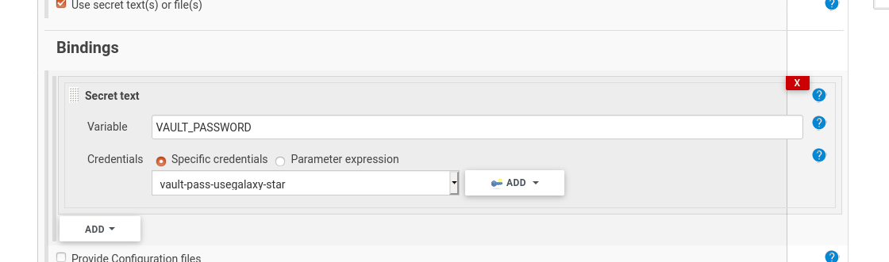

# How to find out any password from Jenkins

1. find out the credential name from the "Bindings" tab in the project's configuration.



2. find the encrypted value:
```
root@build:~$ grep -A1 vault-pass-usegalaxy-star /opt/jenkins/jenkins/jobs/usegalaxy-eu/config.xml
              <description>vault-pass-usegalaxy-star</description>
              <secret>{supersecretstringhere}</secret>
```
3. decrypt

go to jenkins → manage jenkins → script console
https://build.galaxyproject.eu/script

google "jenkins decrypt secret" because you can never remember  
println(hudson.util.Secret.fromString("{supersecretstringhere}").getPlainText())

4. done!

