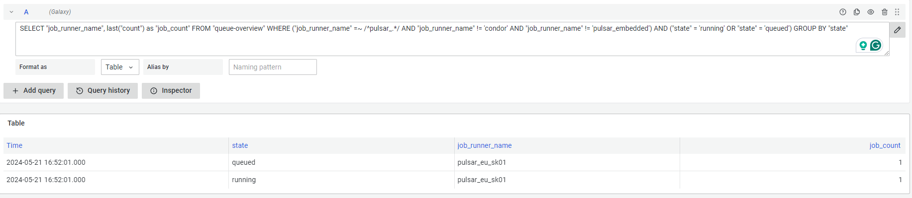
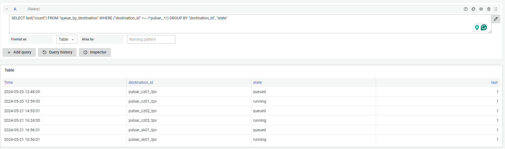

The following measurements are available for ESG use cases (TPV-metascheduler and pulsar job visualizations):

Measurement name: `queue-overview`
Example influx query

```
SELECT "job_runner_name", last("count") as "job_count" FROM "queue-overview" WHERE ("job_runner_name" =~ /^pulsar_.*/ AND "job_runner_name" != 'condor' AND "job_runner_name" != 'pulsar_embedded') AND ("state" = 'running' OR "state" = 'queued') GROUP BY "state"
```



Alternatively, if you want to get the number for each remote compute cluster and not based on the job runners (like above)

Measurement name: `queue_by_destination`
Example influx query

```
SELECT last("count") FROM "queue_by_destination" WHERE ("destination_id" =~ /^pulsar_.*/) GROUP BY "destination_id", "state"
```



_Access to influxdb: Ask the EU admins for ESG influxdb credentials and URLs_
