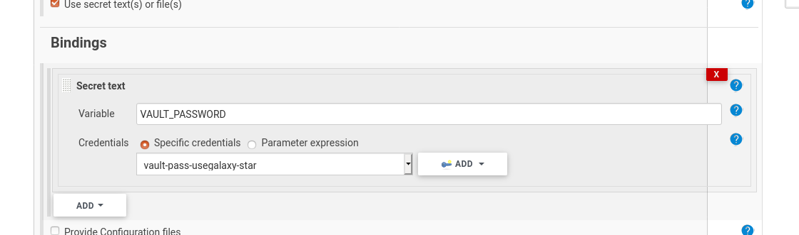

# Change the notice on usegalaxy.eu
Fork the repo, change the file and create a PR:
https://github.com/galaxyproject/galaxy-hub/blob/master/content/bare/eu/usegalaxy/notices.md

# decode Galaxy id
```
user@sn06:~$ . /opt/galaxy/venv/bin/activate
(venv) user@sn06:~$ cd /opt/galaxy
(venv) user@sn06:/opt/galaxy$ python server/scripts/secret_decoder_ring.py decode ec81bbe85ee13506
746380
```
or using gxadmin
```
user@sn06:~$ . /opt/galaxy/venv/bin/activate
(venv) user@sn06:~$ GALAXY_ROOT=/opt/galaxy/server GALAXY_CONFIG_FILE=/opt/galaxy/config/galaxy.yml gxadmin galaxy decode ec81bbe85ee13506
746380
```

# non responsive yum

```
rm -f /var/lib/rpm/__*
rpm --rebuilddb -v -v
yum clean all
```

# visit all compute nodes and execute one command

```console
pdsh -g cloud 'singularity --version | colordiff'
```

# GPUs

Check if tensorflow is compiled with GPU support and a GPU is available.

```python
import tensorflow as tf;
sess = tf.Session(config=tf.ConfigProto(log_device_placement=True));
print(tf.test.is_built_with_cuda()); print( tf.test.is_gpu_available())
```

Check the utilization of the GPU on the host system:

```console
> nvidia-smi 

Sun Aug 25 22:41:01 2019       
+-----------------------------------------------------------------------------+
| NVIDIA-SMI 418.67       Driver Version: 418.67       CUDA Version: 10.1     |
|-------------------------------+----------------------+----------------------+
| GPU  Name        Persistence-M| Bus-Id        Disp.A | Volatile Uncorr. ECC |
| Fan  Temp  Perf  Pwr:Usage/Cap|         Memory-Usage | GPU-Util  Compute M. |
|===============================+======================+======================|
|   0  Tesla T4            Off  | 00000000:00:05.0 Off |                    0 |
| N/A   40C    P0    28W /  70W |      0MiB / 15079MiB |      0%      Default |
+-------------------------------+----------------------+----------------------+
|   1  Tesla T4            Off  | 00000000:00:06.0 Off |                    0 |
| N/A   42C    P0    28W /  70W |      0MiB / 15079MiB |      0%      Default |
+-------------------------------+----------------------+----------------------+
|   2  Tesla T4            Off  | 00000000:00:07.0 Off |                    0 |
| N/A   42C    P0    27W /  70W |      0MiB / 15079MiB |      0%      Default |
+-------------------------------+----------------------+----------------------+
|   3  Tesla T4            Off  | 00000000:00:08.0 Off |                    0 |
| N/A   43C    P0    26W /  70W |      0MiB / 15079MiB |      0%      Default |
+-------------------------------+----------------------+----------------------+
                                                                               
+-----------------------------------------------------------------------------+
| Processes:                                                       GPU Memory |
|  GPU       PID   Type   Process name                             Usage      |
|=============================================================================|
|  No running processes found                                                 |
+-----------------------------------------------------------------------------+

```

# Grafana

Installing or updating Grafana plugins can be done via the grafana-cli tools. Please note that the
plugin folder is mounted from a volume and resides in `/vdb/grafana/plugins/`

```console
ssh stats.galaxyproject.eu
sudo grafana-cli --pluginsDir /vdb/grafana/plugins/ plugins update grafana-worldmap-panel
sudo /etc/init.d/grafana-server restart
```


# How to find out any password from Jenkins

1. find out the credential name from the "Bindings" tab in the project's configuration.



2. find the encrypted value:
```
root@build:~$ grep -A1 vault-pass-usegalaxy-star /opt/jenkins/jenkins/jobs/usegalaxy-eu/config.xml
              <description>vault-pass-usegalaxy-star</description>
              <secret>{supersecretstringhere}</secret>
```
3. decrypt

go to jenkins → manage jenkins → script console
https://build.galaxyproject.eu/script

google "jenkins decrypt secret" because you can never remember  
println(hudson.util.Secret.fromString("{supersecretstringhere}").getPlainText())

4. done!

# How to roll-back Jenkins

Find jenkins.war, in our case its at `/usr/share/java`. Rename the `jenkins.war` file:

```bash
/usr/share/java$ mv jenkins.war jenkins.war_2.375 
```

Get older Jenkins version and restart.

```bash
/usr/share/java$ wget https://updates.jenkins.io/download/war/2.374/jenkins.war
/usr/share/java$ systemctl restart jenkins
```
*or*
Instead of rollback try the newest release with
`sudo yum update jenkins`

# How Condor honors TIaaS priorities

All the details in this https://github.com/usegalaxy-eu/issues/issues/277

# PostgreSQL configuarions

* [PGTune](https://pgtune.leopard.in.ua) is a PG configurator assistent
* configuration files are under /var/lib/pgsql/13/data/

# How to install pdsh with genders support on Centos8

https://gist.github.com/gmauro/cc97ff1287282469ce98c2b8035100f2

# debug 'D' state in processe

Get all processes in D state: 

> ps axl | awk '$10 ~ /D/'

Looking at file handlers of a thread yields to:

```
root@sn06:~$ ll /proc/215503/task/296960/fd/** 
lr-x------ 1 galaxy galaxy 64 Aug  2 17:09 /proc/215503/task/296960/fd/0 -> /dev/null
lrwx------ 1 galaxy galaxy 64 Aug  2 17:09 /proc/215503/task/296960/fd/1 -> 'socket:[3487300049]'
lr-x------ 1 galaxy galaxy 64 Aug  2 17:09 /proc/215503/task/296960/fd/10 -> /data/jwd01/main/048/946/48946081
lr-x------ 1 galaxy galaxy 64 Aug  2 17:11 /proc/215503/task/296960/fd/11 -> /data/jwd01/main/048/946/48946885
lr-x------ 1 galaxy galaxy 64 Aug  2 17:11 /proc/215503/task/296960/fd/12 -> /data/jwd01/main/048/950/48950933
lr-x------ 1 galaxy galaxy 64 Aug  2 17:11 /proc/215503/task/296960/fd/13 -> /data/jwd01/main/048/950/48950933
lrwx------ 1 galaxy galaxy 64 Aug  2 17:09 /proc/215503/task/296960/fd/2 -> 'socket:[3487300049]'
lrwx------ 1 galaxy galaxy 64 Aug  2 17:09 /proc/215503/task/296960/fd/3 -> 'socket:[3487336618]'
lrwx------ 1 galaxy galaxy 64 Aug  2 17:09 /proc/215503/task/296960/fd/4 -> 'socket:[3487342602]'
lrwx------ 1 galaxy galaxy 64 Aug  2 17:09 /proc/215503/task/296960/fd/41 -> 'socket:[3487388502]'
lrwx------ 1 galaxy galaxy 64 Aug  2 17:09 /proc/215503/task/296960/fd/42 -> 'socket:[3487426468]'
lrwx------ 1 galaxy galaxy 64 Aug  2 17:09 /proc/215503/task/296960/fd/43 -> 'socket:[3487471967]'
lrwx------ 1 galaxy galaxy 64 Aug  2 17:09 /proc/215503/task/296960/fd/44 -> 'socket:[3487492268]'
lrwx------ 1 galaxy galaxy 64 Aug  2 17:09 /proc/215503/task/296960/fd/45 -> 'socket:[3501137915]'
lrwx------ 1 galaxy galaxy 64 Aug  2 17:09 /proc/215503/task/296960/fd/47 -> 'socket:[3487842897]'
lrwx------ 1 galaxy galaxy 64 Aug  2 17:09 /proc/215503/task/296960/fd/5 -> 'socket:[3487337597]'
lrwx------ 1 galaxy galaxy 64 Aug  2 17:09 /proc/215503/task/296960/fd/53 -> 'socket:[3518012875]'
l-wx------ 1 galaxy galaxy 64 Aug  2 17:09 /proc/215503/task/296960/fd/6 -> /opt/galaxy/server/compliance.log
lrwx------ 1 galaxy galaxy 64 Aug  2 17:09 /proc/215503/task/296960/fd/7 -> 'socket:[3526229330]'
lr-x------ 1 galaxy galaxy 64 Aug  2 17:11 /proc/215503/task/296960/fd/8 -> /data/jwd01/main/048/946/48946885/metadata
lr-x------ 1 galaxy galaxy 64 Aug  2 17:11 /proc/215503/task/296960/fd/9 -> /data/jwd01/main/048/946/48946081/outputs
```

Which looks ok, Galaxy is cleaning up jobs.
