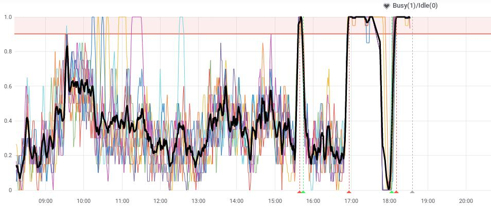

# Setup

We use SystemD instead of supervisor. This makes life much better for us. Previously edits to supervisor files was not trivial and some of the configuration is a bit esoteric. Scaling up and down was not a thing we could do without restarting zerglings.

[Zerg mode](https://uwsgi-docs.readthedocs.io/en/latest/articles/TheArtOfGracefulReloading.html#zerg-mode) is designed such that you can just attach more to your pool in order to scale up. Previously we had been using a more advanced configuration with spinningfifo but were not able to use any of the benefits of this. So we have switched to a simplified version which should offer similar benefits.

We will keep a pool of zerglings attached, `galaxy-zergling@{0..3}`. By default we will keep only 0 and 1 enabled at boot, under heavy load or a restart of zerglings we can enable additional ones as needed. These zerglings are configured with fewer processes than our previous heavy 8-12 process zerglings. By doing this, instead of running two heavy 8-proc zergs during a restart process, we can more marginally increase load by only adding a 4-proc zerg.

# Status / Overview

The current status of each process (compare to `supervisorctl status`):

```
galaxy@sn04:~$ gxadmin local status
galaxy-zergpool:      Active: active (running) since Wed 2019-03-20 14:51:55 CET; 21h ago
galaxy-zergling@0:    Active: active (running) since Thu 2019-03-21 12:03:02 CET; 1min 3s ago
galaxy-zergling@1:    Active: active (running) since Thu 2019-03-21 10:41:54 CET; 1h 22min ago
galaxy-zergling@2:    Active: inactive (dead)
galaxy-zergling@3:    Active: inactive (dead)
```

The current memory usage of each process is available (no supervisor equivalent):

```console
galaxy@sn04:~$ gxadmin local memory
galaxy-zergpool:      Memory: 2.8M (limit: 8.0G)
galaxy-zergling@0:    Memory: 238.8M (limit: 16.0G)
galaxy-zergling@1:    Memory: 10.5G (limit: 16.0G)
galaxy-zergling@2:
galaxy-zergling@3:
```

# Restarting handlers

Equivalent to `supervisorctl restart hd:`

```console
  systemctl restart 'galaxy-handler@*'
```
In theory `galaxy-handler@{0..11}` should also work.

Equivalent to `supervisorctl restart hd:handler_main_1`

```console
systemctl restart galaxy-handler@1
```

# Restarting Zerglings

This is the unintelligent way of doing it.

```
$ gxadmin local zerg-swap
```

*In the future this will be automated*, but the intelligent way is:

```
$ systemctl start galaxy-zergling@2 # One that is off
```

wait until this comes up (stats addresses are 127.0.0.1:401# where # is the part after @, you can just `curl 127.0.0.1:4012` a few times until this comes up. gxadmin has a built in function but it isn't exposed.)

Once it's up, there should be three zerglings running. We can do something like:

```
for i in {1..50}; do curl https://usegalaxy.eu/api/version; done;
```

to check that everything is responding. It is likely you'll be spread across all three zerglings. If nothing errors, then you can go ahead and restart 1/2 in series.

# Scaling Up / Down

This should be an extremely rare phenomenon. This should only occur if:

- there is high worker load
	- not system load
	- not IO time
- the workers are answering requests, just experiencing more traffic than normal
	- high busy graph
	- medium to high requests as well
	- (low might indicate broken NFS)
- the **black line** in [this graph](https://stats.galaxyproject.eu/d/000000004/galaxy?refresh=5m&panelId=102&fullscreen&orgId=1&from=now-6h&to=now) must be over 90% for a portion of time
	- individual lines are normal, the black is the average over all and gives a better idea of "are ALL of the workers working at full capacity". If workers report idle, then there is no point to scale.

Then it might be OK to scale up.



Scaling down should be done when it returns to normal.

# Expected memory consumption of Galaxy processes

* Galaxy 23.0
  *  web-handler (after 20h): 16.8, 12.5, 11.1
  *  web-handler (after 21h): 15, 19, 16
  *  web-handler (fresh <1h): 6.9, 6.8, 7.1
  *  job-handler (after 20h): 5.0, 5.0, 4.5, 3.5, 3.5 3., 2.9
    * after a restart they seem to have 3.0 GB of memory allocated  
  *  workflow-handler (after 20h): 3.0, 3.0, 3.0

* Galaxy 24.2
  *  web-handler (after 10h): 13.5, 8.6, 10.0, 17.0, 10.8, 9.1
  *  job-handler (after 10h): 2.7, 3.5, 2.6, 2.5, 2.1
  *  workflow-handler (after 10h): 2.6, 2.0, 2.6, 1.9
