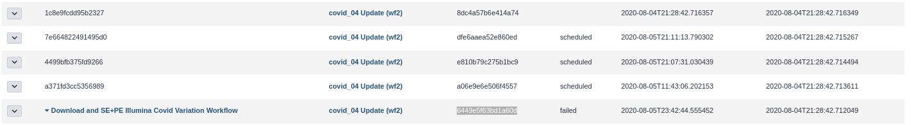

# Workflows

If you have some workflows that are in a `failed` state, because of single jobs failing and re-running turned the workflow to stop, than you can do the following.



```bash
galaxy@sn04:~$ . venv/bin/activate
(venv) galaxy@sn04:~$ python server/scripts/secret_decoder_ring.py -c config/galaxy.ini decode 64496a6at62626260d
111111
(venv) galaxy@sn04:~$ psql 
psql (9.2.24, server 9.6.6)
Type "help" for help.
galaxy=> UPDATE workflow_invocation SET state = 'ready' WHERE id = 111111;
```
